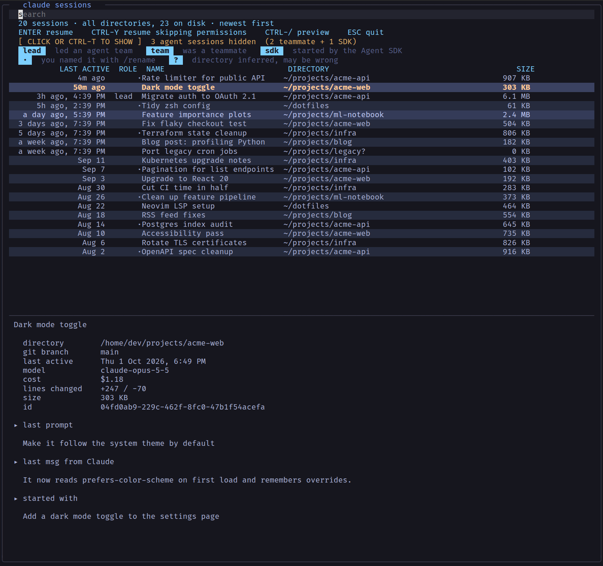
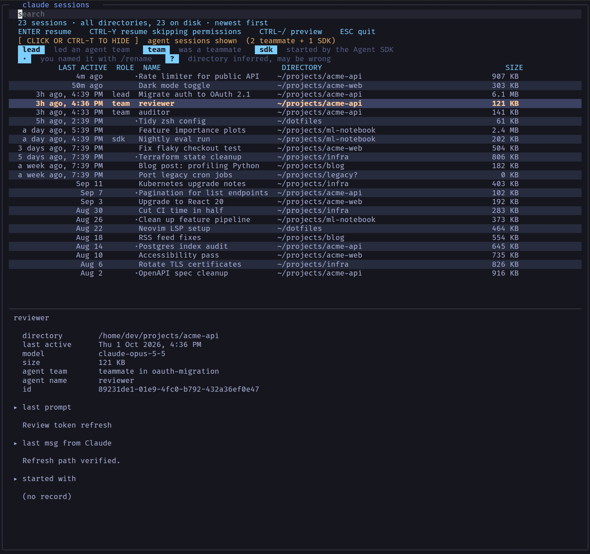
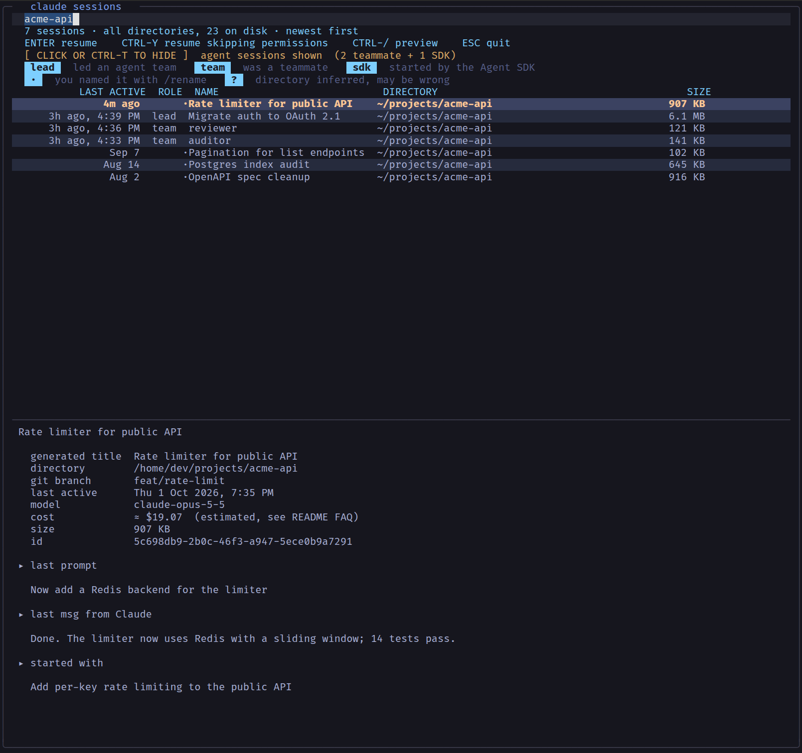
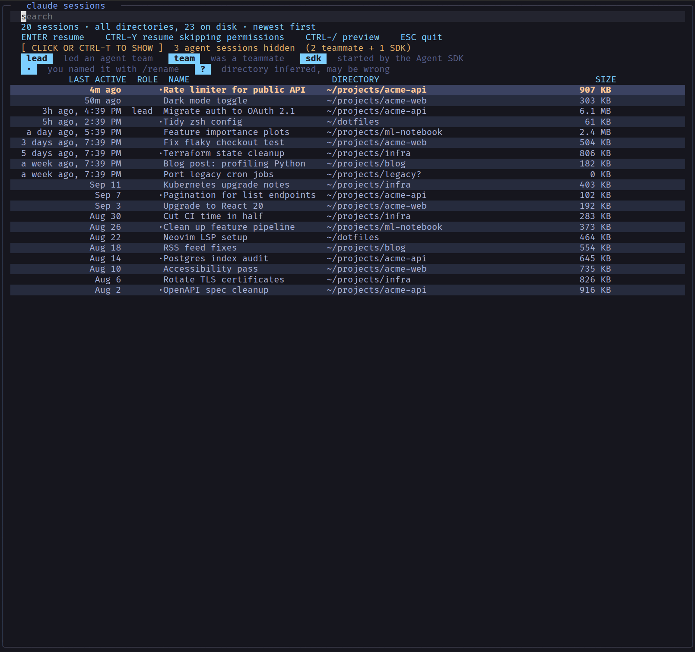
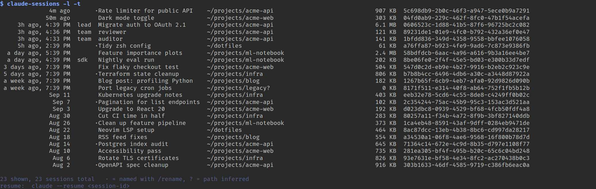

# claude-sessions

Browse every Claude Code session on your machine, from any directory, and resume one.

`claude --resume` only shows sessions for the directory you're in. `claude-sessions` reads the session store directly (`~/.claude/projects/<encoded-cwd>/<session-id>.jsonl`), lists every session newest first, and when you pick one it `cd`s into **that session's own working directory** and runs `claude --resume <id>` there.

## Features

- A full-screen terminal picker built on [Textual](https://textual.textualize.io/), with fuzzy search, alternating row colours, mouse hover highlighting and click support
- Columns: last active ("3h ago, 2:15 PM", "a day ago, …", then "Sep 4"), role, name, directory, size (KB/MB)
- Session names, in order of preference: your `/rename` title, then the generated title, then the agent name
- A preview pane with the directory, git branch, model, cost (estimated when Claude Code hasn't recorded it yet), lines changed, the last prompt, Claude's last message, and the opening prompt
- Agent sessions (agent-team teammates and Agent SDK runs) are hidden by default; press `CTRL-T` or click the toggle line to show them. Team leads are tagged `lead`.
- Sessions started in `/tmp` and sessions with no messages are hidden by default
- Plain-list mode for scripts and pipes

## Screenshots

These screenshots use an invented demo session store generated by [`docs/make_screenshots.py`](docs/make_screenshots.py). No real sessions appear in them.

**The picker.** Sessions from every directory, newest first. The legend shows the role badges and markers. `·` marks a session you renamed and `?` marks a directory inferred from the store. The selected row is amber, the mouse is hovering over "Feature importance plots", and the preview pane shows the directory, git branch, model, cost, lines changed, plus the **last prompt**, **Claude's last message** and the **opening prompt**.



**Agent sessions revealed** (press `CTRL-T` or click the toggle line). This view shows the `lead` of an agent team, its two `team` teammates, and an `sdk` run. A teammate is selected, so the preview shows its team and agent name.



**Fuzzy search** over name, directory and id. Here `acme-api` matches the lead, both teammates and several ordinary sessions. The selected session is still running, so its cost is marked `≈` as an estimate (see the FAQ).



**Preview hidden** (`CTRL-/`) to give the list the full height.



**Plain-list mode** (`-l`, used automatically when the output is piped). Full session ids are included so you can script against them.



## Platform support

**Built for and tested only on Claude Code running inside WSL (Ubuntu on Windows).** Other Linux distributions should work the same way, since it's plain Python with a bash installer. That has not been tested.

- **macOS:** not tested and not officially supported. It may work, but nobody has tried it.
- **Native Windows** (PowerShell/cmd): **not supported.** The installer is bash, and the time formatting and `exec`-based resume are POSIX-only. Run Claude Code and this tool inside WSL instead.

## Install

Requires Python 3.9+ with the `venv` module (on Ubuntu, `sudo apt install python3-venv`) and Claude Code (`claude` on your PATH).

```bash
git clone https://github.com/Aztec03hub/claude-sessions.git
cd claude-sessions
./install.sh
```

`install.sh` creates a private venv at `~/.local/share/claude-sessions/venv`, installs Textual into it, and writes the `claude-sessions` command to `~/.local/bin`. You can override those locations with `XDG_DATA_HOME` and `BIN_DIR`. If that directory isn't already on your `PATH`, the installer appends an `export PATH=...` line to `~/.bashrc` (and to `~/.zshrc` if you have one). Open a new shell, or run `source ~/.bashrc`, and `claude-sessions` works from anywhere. Running the installer again is safe: it upgrades in place and never duplicates the PATH line.

Manual alternative: run `pip install textual`, then copy `claude-sessions` anywhere on your PATH.

## Usage

```
claude-sessions                 picker
claude-sessions stremio         picker, pre-filtered
claude-sessions -y              resume with --dangerously-skip-permissions
claude-sessions -l              plain list, no picker (also automatic when piped)
claude-sessions -n 50 / -a      how many to load (default 300) / load all
claude-sessions -d              only sessions from the current directory
claude-sessions -t              include agent sessions
claude-sessions -s              include /tmp sessions
claude-sessions -e              include sessions with no messages
claude-sessions --deep          read whole files (slower, finds early-only titles)
claude-sessions --id <prefix>   print the full id for a prefix, then exit
claude-sessions --print-cd      print the cd && claude command instead of running it
claude-sessions --doctor        explain why the picker did or didn't appear
```

### Picker keys

| Key | Action |
|---|---|
| type | fuzzy search over name, path and id |
| ↑/↓, `CTRL-J`/`CTRL-K`, mouse wheel | move |
| `ENTER` / click | resume |
| `CTRL-Y` | resume with `--dangerously-skip-permissions` |
| `CTRL-T` / click the toggle line | show or hide agent sessions |
| `CTRL-/` | toggle the preview pane |
| `CTRL-U` | clear the search |
| `ESC` | quit |

### Markers

- `·` means you named the session with `/rename`
- `?` means the directory was inferred from the store's folder name, which is lossy (`/` and `_` both encode as `-`). The tool never `cd`s into an inferred directory that doesn't exist.

## FAQ

### Why do some sessions show a cost and others don't, or show `≈`?

Claude Code doesn't write cost into a transcript as it goes. It appends one `cost-state` record **when a session process exits**. That record holds the running totals: dollars, tokens per model, and lines added and removed. Those totals carry over when you `--resume`, so the newest record is the session's whole history up to its last exit. That leaves three cases:

| Case | What you see |
|---|---|
| The session exited cleanly and hasn't been used since | `cost  $12.34`, exact, taken from Claude Code's own record |
| The session has **never exited**: it's running right now, or it crashed or was killed | No record exists, so the cost is **estimated** and shown as `≈ $4.73 (estimated)` |
| The session was resumed and is running, or died, after its last exit | The record is exact up to that exit. The work since then is estimated and added on, so you see `≈` |

Earlier versions of this tool had a second, separate bug. They only searched the last 4 MB of a file for the cost record, and a long resumed session can leave that record more than 13 MB from the end, so the cost silently disappeared. The tool now searches the whole file, backwards.

### How is the estimate calculated, and how accurate is it?

Every reply in a transcript records its token usage: input, output, cache reads, and 5-minute and 1-hour cache writes. The estimate adds up the usage since the last cost record. It counts each API response once, even though it's written as several records, and it includes the session's **subagent** transcripts, because subagent spend is billed to the parent. The total is then priced like this:

- The price ratios between token types come from Anthropic's published pricing structure: output costs 5× input, cache reads 0.1×, 5-minute cache writes 1.25× and 1-hour cache writes 2×.
- The **base price per model is measured, not hard-coded.** It's derived from the session's own earlier cost record, or failing that, from the newest cost record on disk that used the same model. There's no price table to go out of date.

I back-tested it on this machine. For each consecutive pair of real cost records, it estimated the second from the first. The median error was about **6.5%**, with a slight tendency to come in low. A few sessions were far off, probably because of spend the transcript doesn't record (for example background or teammate work). Treat `≈` as a good ballpark, not an invoice. If no cost record on disk has ever used a session's model, no estimate is shown.

### What is "lines changed"?

`+added / -removed` lines from Claude's file edits, taken from the same `cost-state` record. It isn't cost, so it has its own row. It reflects the session as of its last exit and isn't estimated.

## Why Textual (and not fzf)

The first version was a plain Python list printer. Next it became an fzf front end, and then it was rewritten in Textual. The switch to Textual happened because fzf only applies its focus colours where the row text doesn't set its own colours. That makes alternating row stripes and a uniformly highlighted focused row mutually exclusive, and fzf has no mouse-motion events, so hover highlighting is impossible. Textual's CSS cascade lets the focus and hover rules override the stripe rule, and it allows full colour theming. Everything else matches the original fzf behaviour.

## How it works

- Files are read **backwards** from the tail (256 KB by default) to find the newest title and cwd cheaply. Titles are rewritten during a session and the last one wins, and long sessions can run to hundreds of MB.
- The session's `entrypoint` (`cli` vs `sdk-*`) separates sessions you started yourself from Agent SDK runs.
- Team leads come from `~/.claude/teams/*/config.json` (`leadSessionId`), so only teams that are currently active are detected.
- **Subagent transcripts are never listed.** They live at `<session>/subagents/agent-*.jsonl`, outside the scan. A subagent can't be resumed on its own, so listing it would only add noise. Its parent session is listed as usual.

To regenerate the screenshots, run `python docs/make_screenshots.py` in a venv that has Textual. It writes the SVGs into `docs/`, and the PNGs are those SVGs rendered with headless Chrome at their native size.

The tool is read-only: nothing in `~/.claude` is ever modified.
