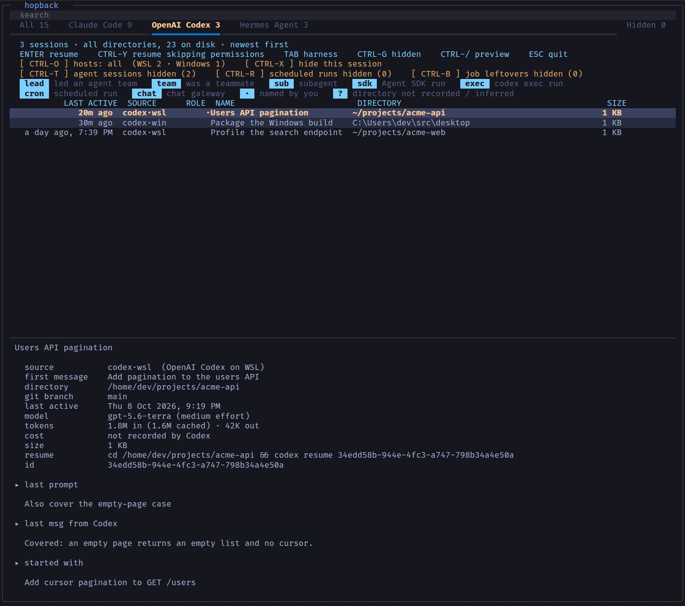
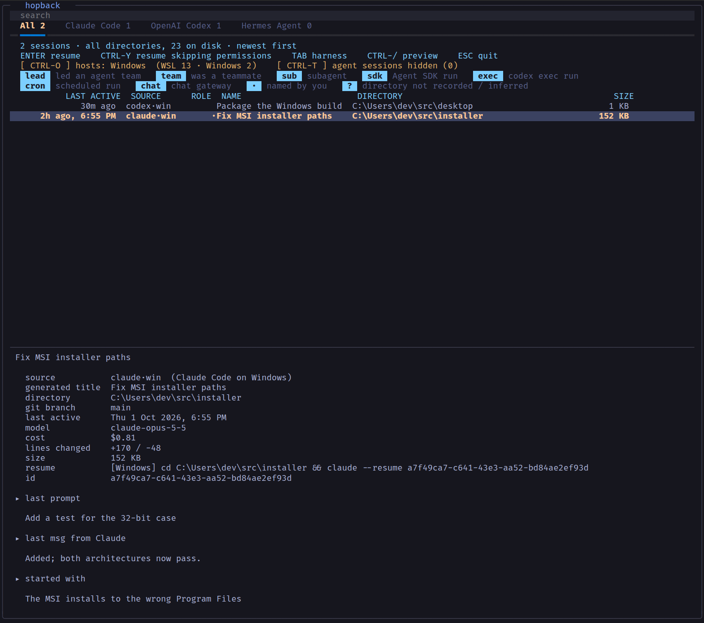
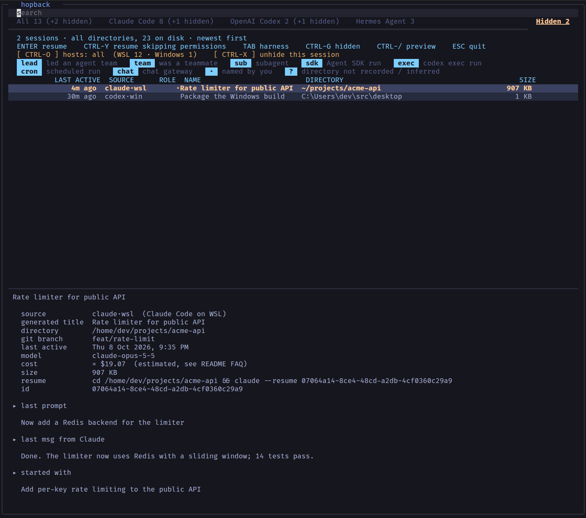

# hopback

Browse every AI coding-agent session on your machine (Claude Code, OpenAI Codex and Hermes Agent, from WSL **and** Windows) in one list, from any directory, and hop back into one.

> Formerly `claude-sessions`. The `claude-sessions` command still works and still means "Claude Code sessions only".

Each agent's own resume command only knows about sessions for the directory you're in, on the OS you're in. `hopback` reads every agent's session store directly, lists everything newest first, and when you pick one it runs **that agent's resume command in that session's own working directory**. A Windows session picked from WSL is resumed on Windows, through PowerShell, in its Windows folder.

## Supported agents

| Agent | Store it reads | Resumes with | Notes |
|---|---|---|---|
| **Claude Code** | `~/.claude/projects/*/*.jsonl` | `claude --resume ID` | Titles, `/rename`, agent teams, exact or estimated cost, lines changed |
| **OpenAI Codex CLI** | `~/.codex/state_5.sqlite` + rollout JSONL | `codex resume ID` | Renames, subagents, `codex exec` runs, token totals (Codex records no cost) |
| **Hermes Agent** | `~/.hermes/state.db` and every profile's `state.db` | `hermes -p PROFILE --resume ID` | Profiles, subagents, scheduled (cron) runs, chat-gateway sessions, tokens |

Each agent is a small adapter in [`hopback/adapters/`](hopback/adapters/). More are planned: the [research](docs/research/) covers about 30 command-line agents, and [docs/PLAN.md](docs/PLAN.md) ranks them.

### Hosts

From inside WSL, hopback also looks in your Windows profile (`/mnt/c/Users/<you>/`) for each agent's store, so `claude·wsl` and `claude·win` (or `codex·wsl` and `codex·win`) sit side by side, each labelled in the **SOURCE** column. Windows paths are shown as Windows paths (`C:\src\app`). Resuming a Windows session runs PowerShell, changes to the session's Windows folder and runs the agent there. If that agent isn't installed on Windows, PowerShell says so plainly.

## Features

- A full-screen picker built on [Textual](https://textual.textualize.io/): fuzzy search, alternating row colours, mouse hover and click
- **Harness tabs** (`All · Claude Code · OpenAI Codex · Hermes Agent`), each with a live count; `TAB` cycles them, or click one
- A **host filter** (`CTRL-O` or click): all hosts, then this one, then Windows, with per-host counts
- Columns: last active ("3h ago, 2:15 PM", "a day ago, …", then "Sep 4"), **source** (`codex·win`), role, name, directory, size
- Roles, each with a badge: `lead` and `team` (Claude agent teams), `sub` (subagents), `sdk` (Agent SDK runs), `exec` (`codex exec` runs), `task` (Hermes kanban), `cron` (scheduled runs), `chat` (Hermes chat gateways), `ide` (Codex threads started from an editor), `spawn` (a Claude Code session another session's Claude started, see FAQ), `copy` and `job` (Claude Code background-job leftovers, see below)
- **Agent sessions** are hidden by default (`CTRL-T`), **scheduled runs** have their own toggle (`CTRL-R`), and so do **background-job leftovers** (`CTRL-B`)
- **Hide any session yourself** with `CTRL-X`. Each tab shows how many of its sessions you've hidden, and the **Hidden** view at the far right of the tab row (click it or press `CTRL-G`) lists them all with the harness each came from. `CTRL-X` there unhides one. `TAB` skips the Hidden view. The list is kept in `~/.local/state/hopback/hidden.json`
- The preview loads in the background, so moving through the list never waits on a large transcript
- A preview pane with the same shape for every agent: source, directory, git branch, model, cost or tokens, lines changed, the exact **resume command**, the **last prompt**, the **agent's last message** and the **opening prompt**
- Sessions in `/tmp`, empty sessions and archived sessions are hidden by default
- If one store can't be read (a schema change, a locked database), the others still load and the problem shows as a red line in the header
- Plain-list mode for scripts and pipes

## Screenshots

These screenshots use an invented demo store generated by [`tests/demo_store.py`](tests/demo_store.py). No real sessions appear in them.

**Everything at once.** Claude Code, Codex and Hermes sessions from WSL and Windows, newest first, with the source of each row in the SOURCE column. A Codex session is selected, so the preview shows its tokens, the exact resume command, its last prompt, **Codex's last message** and its opening prompt.


**One harness** (press `TAB` or click a tab). The Codex tab shows Codex sessions from both WSL and Windows.



**Windows sessions** (press `CTRL-O` until it reads Windows). A Claude Code session recorded on Windows: its folder is a Windows path, and the resume line shows it will run on Windows.



**Agent sessions and scheduled runs revealed** (`CTRL-T` and `CTRL-R`). This adds the Claude agent team (`lead` plus two `team` members), a Codex subagent (`sub`) and `exec` run, a Claude `sdk` run, a Hermes subagent, and Hermes's `cron` digests. A teammate is selected.


**The Hidden view** (`CTRL-G`, or click **Hidden** at the far right). Two sessions were hidden with `CTRL-X`: one Claude Code session on WSL and one Codex session on Windows. The SOURCE column shows where each came from, and every tab counts its own hidden sessions.



**Search** ANDs the words you type and also matches the source, so `codex win` or `hermes acme` work. Here `acme-api` finds sessions from all three agents.


**Plain-list mode** (`-l`, used automatically when the output is piped), with every role shown (`-t -r`) and full session ids.


## Platform support

**Built for and tested on WSL (Ubuntu on Windows)**, reading both the WSL and the Windows side. Other Linux distributions should work the same way (minus the Windows side), since it's plain Python with a bash installer, but that hasn't been tested.

- **macOS:** not tested and not officially supported.
- **Native Windows** (PowerShell/cmd): **not supported.** The installer is bash, and the time formatting and `exec`-based resume are POSIX-only. Run hopback inside WSL; it still finds and resumes your Windows sessions.

## Install

Requires Python 3.10+ with the `venv` module (on Ubuntu, `sudo apt install python3-venv`), plus whichever agents you use on your PATH.

```bash
git clone https://github.com/Aztec03hub/hopback.git
cd hopback
./install.sh
```

`install.sh` creates a private venv at `~/.local/share/hopback/venv`, installs the package (with Textual, tree-sitter and tree-sitter-bash) into it, and links `hopback` and `claude-sessions` into `~/.local/bin`. You can override those locations with `XDG_DATA_HOME` and `BIN_DIR`. If that directory isn't already on your `PATH`, the installer appends an `export PATH=...` line to `~/.bashrc` (and to `~/.zshrc` if you have one). Open a new shell, or run `source ~/.bashrc`, and `hopback` works from anywhere. Running the installer again is safe: it upgrades in place and never duplicates the PATH line.

Manual alternative: `pip install .` from the clone, which installs both commands.

## Usage

```
hopback                       every session, every agent, every host
hopback codex                 one agent: claude, codex or hermes
hopback --host win            one host: wsl, win, linux or mac
hopback codex stremio         an agent plus a pre-filter
hopback -y                    resume skipping permission prompts (each agent's own flag)
hopback -l                    plain list, no picker (also automatic when piped)
hopback -n 50 / -a            how many to load per store (default 300) / load all
hopback -d                    only sessions from the current directory
hopback -t / -r               include agent sessions / scheduled runs
hopback -b                    include background-job leftovers (older copies, job scratch runs)
hopback -l --hidden           list only the sessions you hid with CTRL-X
hopback --review              open on the Review view (also F12): check every spawn mark
hopback -s / -e / --archived  include /tmp, empty, archived sessions
hopback --deep                read whole Claude files (slower, finds early-only titles)
hopback --id <prefix>         print the full id for a prefix, then exit
hopback --print-cd            print the resume command instead of running it
hopback --doctor              list every store found and why the picker did or didn't appear
claude-sessions               the old command: Claude Code sessions only
```

`-y` maps to `--dangerously-skip-permissions` for Claude Code, `--dangerously-bypass-approvals-and-sandbox` for Codex and `--yolo` for Hermes.

Environment: `HOPBACK_NO_WINDOWS=1` skips the Windows side; `HOPBACK_WINDOWS_HOME=/path` points it somewhere other than `/mnt/c/Users/<you>`.

### Picker keys

| Key | Action |
|---|---|
| type | fuzzy search; space-separated words must all match, in any order |
| ↑/↓, `CTRL-J`/`CTRL-K`, mouse wheel | move |
| `ENTER` / click | resume |
| `CTRL-Y` | resume skipping permission prompts |
| `TAB` / `SHIFT-TAB` / click a tab | next / previous agent tab |
| `CTRL-O` / click the hosts control | cycle hosts: all, this one, Windows |
| `CTRL-T` / click | show or hide agent sessions |
| `CTRL-R` / click | show or hide scheduled runs |
| `CTRL-B` / click | show or hide background-job leftovers |
| `CTRL-X` / click | hide this session, or unhide it in the Hidden view |
| `CTRL-G` / click **Hidden** | open the Hidden view; `TAB` or a click on a tab goes back |
| `F12` | show the **Review** tab and open it (again: hide it); see "What does `spawn` mean" |
| `1` / `2` / `3` / `0` (Review view only) | mark the session: accepted, it was spawned / rejected, I started it / needs discussion / clear |
| `CTRL-/` | toggle the preview pane |
| `CTRL-U` | clear the search |
| `ESC` | quit |

### Markers

- `·` means you named the session (Claude `/rename`, a Codex rename, or a user-set Hermes title)
- `?` means the directory was inferred from Claude's folder name, which is lossy (`/` and `_` both encode as `-`). hopback never `cd`s into an inferred directory that doesn't exist.
- `-` in the directory column means the agent recorded no directory (Hermes cron and chat sessions)

## FAQ

### Why do some Claude sessions show a cost and others don't, or show `≈`?

Claude Code doesn't write cost into a transcript as it goes. It appends one `cost-state` record **when a session process exits**. That record holds the running totals: dollars, tokens per model, and lines added and removed. Those totals carry over when you `--resume`, so the newest record is the session's whole history up to its last exit. That leaves three cases:

| Case | What you see |
|---|---|
| The session exited cleanly and hasn't been used since | `cost  $12.34`, exact, taken from Claude Code's own record |
| The session has **never exited**: it's running right now, or it crashed or was killed | No record exists, so the cost is **estimated** and shown as `≈ $4.73 (estimated)` |
| The session was resumed and is running, or died, after its last exit | The record is exact up to that exit. The work since then is estimated and added on, so you see `≈` |

Earlier versions only searched the last 4 MB of a file for the cost record, and a long resumed session can leave it more than 13 MB from the end, so the cost silently disappeared. hopback now searches the whole file, backwards.

### How is the Claude estimate calculated, and how accurate is it?

Every reply in a transcript records its token usage: input, output, cache reads, and 5-minute and 1-hour cache writes. The estimate adds up the usage since the last cost record. It counts each API response once, even though it's written as several records, and it includes the session's **subagent** transcripts, because subagent spend is billed to the parent. The total is then priced like this:

- The price ratios between token types come from Anthropic's published pricing structure: output costs 5× input, cache reads 0.1×, 5-minute cache writes 1.25× and 1-hour cache writes 2×.
- The **base price per model is measured, not hard-coded.** It's derived from the session's own earlier cost record, or failing that, from the newest cost record among your 200 most recent sessions that used the same model. Those records are read once, when hopback starts: a model first used after that shows no estimate until the next launch. There's no price table to go out of date.

Back-tested on real sessions by estimating each cost record from the one before it, the median error was about **6.5%**, slightly low on average. A few sessions were far off, probably because of spend the transcript doesn't record. Treat `≈` as a good ballpark, not an invoice. If none of those 200 sessions has a cost record for a session's model, no estimate is shown.

### Why does Codex show tokens but no cost?

Codex records token usage but not dollars, and hopback doesn't guess prices for models it can't measure. Hermes shows a cost only when it priced the provider itself; otherwise it shows tokens.

### What is "lines changed"?

`+added / -removed` lines from Claude's file edits, taken from the same `cost-state` record. It isn't cost, so it has its own row. It reflects the session as of its last exit and isn't estimated.

### Why did one Claude session show up twice?

If you exit Claude Code while background work is still running (a background agent or shell), Claude Code hands the conversation to a background job under a **new session id**. It copies the history into a new file, and the old file ends with a `continued-in` record that names the new one. hopback marks that old file `copy` and hides it with the other background-job leftovers (`CTRL-B` shows them). The preview pane names the session it continued in.

If the old id is resumed after the hand-over and gets a reply, the two copies have diverged and both hold real work. In that case hopback shows both. Sessions that a background job runs inside its own scratch directory (`~/.claude/jobs/<id>/tmp/...`) are marked `job` and hidden the same way.

### What does `spawn` mean, and how sure is it?

Scripts and bots often start a full interactive `claude` in a tmux pane, for example a launcher, an implementer or a test run. On its own such a session looks like one you started, so hopback works out which session started it. A session is marked `spawn` only when all three of these are true:

1. Another session's Claude ran a shell command that invokes `claude`. That is a tool call, and text you type or paste never is.
2. This session began within 30 seconds after that command.
3. The opening of this session's prompt appears in that Claude's own tool calls: in the launch command, in a file it wrote in the ten minutes before, or in what it typed in afterwards with `tmux send-keys`. Quote marks and backslashes are ignored, because the shell strips them on the way in.

A prompt you paste into one session and also type into a new one doesn't qualify, because your messages are not tool calls. `spawn` is one kind of agent session: subagents (`sub`) and teammates (`team`) are started by a Claude too, but Claude Code records them as such, so they get their own badges and never need this inference. `spawn` sessions are hidden with the other agent sessions (`CTRL-T`), and the preview names the session that started them. hopback errs towards **not** marking: a prompt assembled from shell variables (`"$DIR/brief.md"`) can't be matched, so such a session stays visible.

To check the rule against your own sessions, press `F12` (or run `hopback --review`). The **Review** tab lists every session marked `spawn`, the ones that would leave your list first, and the preview shows the evidence: the parent session, the gap, which part of rule 3 held, and the launch command. Mark each one with `1` (accepted, it was spawned), `2` (rejected, I started it), `3` (needs discussion) or `0` (clear). Marks are saved in `~/.local/state/hopback/review.json`, and a rejected session goes straight back to looking like yours. If `hidden.json` or `review.json` is ever damaged, hopback moves it aside as `<name>.damaged-<time>-<pid>` (a new copy each time), tells you, and starts that list afresh, so nothing is overwritten.

The first run finds launch commands with [ripgrep](https://github.com/BurntSushi/ripgrep) if it is installed (about 2 s over 10 GB of transcripts, measured 2026-10-08) and with plain Python otherwise (several seconds). After that only newly written bytes are read, and the result is cached in `~/.cache/hopback/`.

### A Windows session says the agent "is not installed on Windows"

The session was recorded by an agent you ran on Windows, but that agent isn't on the Windows `PATH` any more (or was a desktop app). Install the CLI on Windows, or resume a WSL session instead.

## How it works

- **Claude Code:** files are read **backwards** from the tail to find the newest title and cwd cheaply; titles are rewritten during a session and the last one wins. The `entrypoint` (`cli` vs `sdk-*`) separates sessions you started from Agent SDK runs. Team leads come from `~/.claude/teams/*/config.json`. Subagent transcripts (`<session>/subagents/`) are never listed; they can't be resumed on their own.
- **Codex:** one read-only query of the `threads` index lists everything. The preview reads the rollout file backwards, and understands both the older `user_message`/`agent_message` events and the newer `item_completed` ones. `response_item` messages with role `user` are injected context, so they're never shown as your prompt.
- **Hermes:** one read-only query per profile database; messages come from its `messages` table. The profile is always passed when resuming, so a sticky `hermes profile use` can't send the resume to the wrong database.
- **SQLite stores are opened strictly read-only** (`mode=ro`): they're live databases other programs are writing.
- **hopback never modifies any agent's data.**

## Development

```bash
python tests/test_hopback.py          # or: python -m pytest tests
python docs/make_screenshots.py       # regenerate docs/*.svg from the demo store
bash docs/render_pngs.sh              # render them to PNG with headless Chrome
```

The tests build the same fake multi-agent, multi-host store as the screenshots and check discovery, roles, previews (including both Codex event formats), resume commands, the Windows PowerShell wrapper, path conversion and the picker's keys.

## Why Textual (and not fzf)

The first version was a plain Python list printer. Next it became an fzf front end, and then it was rewritten in Textual, because fzf only applies its focus colours where the row text doesn't set its own colours. That makes alternating row stripes and a uniformly highlighted focused row mutually exclusive, and fzf has no mouse-motion events, so hover highlighting is impossible. Textual has mouse-motion events, and the list is a widget that paints its own visible rows (SessionList), so the stripes, the uniform focused row and the hover colour are all set in one place and can't fight each other.
